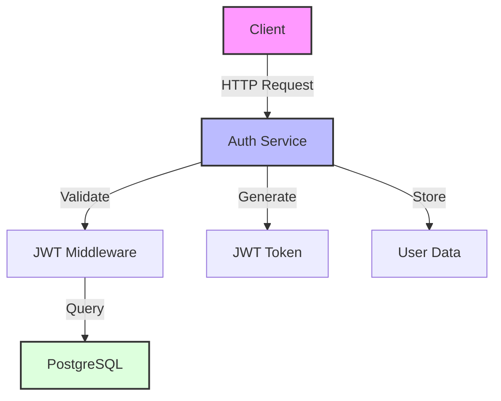
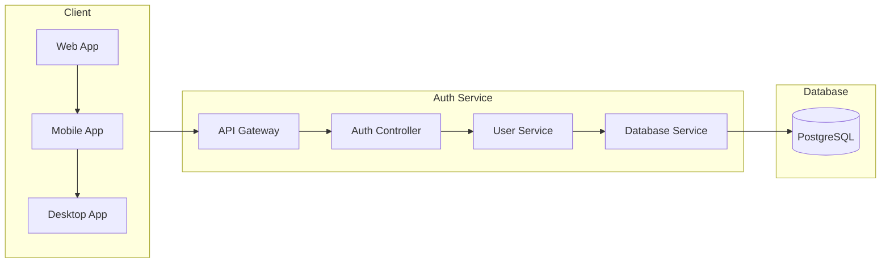
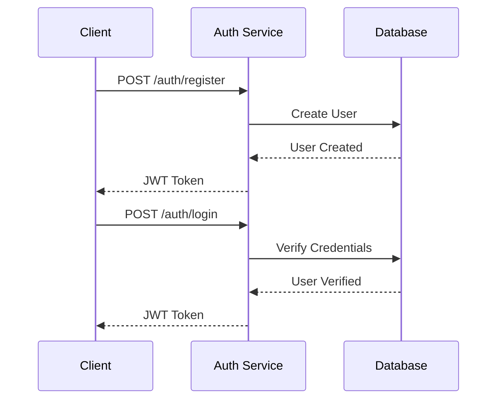
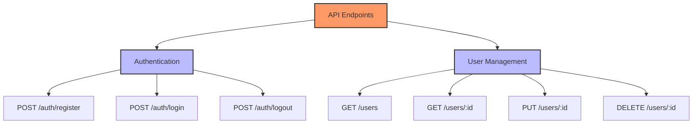

# 🔐 Authentication Service

<div align="center">
  
  
  
  
  
</div>

A robust authentication microservice built with TypeScript, Express, and TypeORM, featuring JWT-based authentication and comprehensive user management.

## 📋 Table of Contents
- [Features](#-features)
- [Architecture](#-architecture)
- [Prerequisites](#-prerequisites)
- [Getting Started](#-getting-started)
- [Docker Setup](#-docker-setup)
- [API Documentation](#-api-documentation)
- [Development](#-development)

## ✨ Features
<div align="center">
  <table>
    <tr>
      <td align="center">🔐</td>
      <td>JWT-based authentication</td>
      <td align="center">👤</td>
      <td>User management (CRUD)</td>
    </tr>
    <tr>
      <td align="center">🔒</td>
      <td>Role-based access control</td>
      <td align="center">📝</td>
      <td>Request validation</td>
    </tr>
    <tr>
      <td align="center">🐳</td>
      <td>Docker support</td>
      <td align="center">📊</td>
      <td>PostgreSQL database</td>
    </tr>
    <tr>
      <td align="center">🧪</td>
      <td>Unit testing with Jest</td>
      <td align="center">🔍</td>
      <td>Request logging</td>
    </tr>
  </table>
</div>

## 🏗️ Architecture

### System Overview


### Data Flow


## 📦 Prerequisites
<div align="center">
  <table>
    <tr>
      <td align="center">⚡</td>
      <td>Node.js (v18 or higher)</td>
    </tr>
    <tr>
      <td align="center">🐘</td>
      <td>PostgreSQL</td>
    </tr>
    <tr>
      <td align="center">🐳</td>
      <td>Docker (optional)</td>
    </tr>
    <tr>
      <td align="center">📦</td>
      <td>npm or yarn</td>
    </tr>
  </table>
</div>

## 🚀 Getting Started

### 1️⃣ Clone the repository
```bash
git clone <repository-url>
cd auth-service
```

### 2️⃣ Install dependencies
```bash
npm install
```

### 3️⃣ Configure environment variables
Create a `.env` file in the root directory:
```env
PORT=5501
DB_HOST=localhost
DB_PORT=5432
DB_USERNAME=root
DB_PASSWORD=root
DB_DATABASE=auth_db
JWT_SECRET=your_jwt_secret
```

### 4️⃣ Start the service
```bash
npm run dev
```

## 🐳 Docker Setup

### Development Environment

#### 1️⃣ Build the Docker image
```bash
docker build -t auth-service:dev -f docker/dev/Dockerfile .
```

#### 2️⃣ Run the container
```bash
# For PowerShell
docker run --rm -it -v ${PWD}:/usr/src/app -v /usr/src/app/node_modules --env-file ${PWD}/.env.dev -p 5501:5501 -e NODE_ENV=development auth-service:dev

# For Command Prompt
docker run --rm -it -v %cd%:/usr/src/app -v /usr/src/app/node_modules --env-file %cd%/.env.dev -p 5501:5501 -e NODE_ENV=development auth-service:dev
```

### Database Setup

#### 1️⃣ Create a persistent volume
```bash
docker volume create mernpgdata
```

#### 2️⃣ Run PostgreSQL container
```bash
docker run --rm --name mernpg-container \
  -e POSTGRES_USER=root \
  -e POSTGRES_PASSWORD=root \
  -v mernpgdata:/var/lib/postgresql/data \
  -p 5432:5432 \
  -d postgres
```


#### 2️⃣ Generate migration
#### 2️⃣ add this command to the script of package.json
"scripts": {
      "dev": "cross-env NODE_ENV=dev nodemon --legacy-watch src/server.ts",
      "test": "jest --watch --runInBand",
      "start": "ts-node src/index.ts",
      "migration:generate": "typeorm-ts-node-commonjs migration:generate",
      "migration:run": "typeorm-ts-node-commonjs migration:run",
      "migration:create": "typeorm-ts-node-commonjs migration:create",
      "docker:pg": "docker run --rm --name mernpg-container -e POSTGRES_USER=root -e POSTGRES_PASSWORD=root -v mernpgdata:/var/lib/postgresql/data -p 5432:5432 -d postgres",
      "docker:express": "docker run --rm -it -v %cd%:/usr/src/app -v /usr/src/app/node_modules --env-file %cd%\\.env.dev -p 5501:5501 -e NODE_ENV=development auth-service:dev",
      "docker:up": "npm run docker:pg && npm run docker:express"
   },

#### 2️⃣ Run this command in terminal to generate the migration file inside the migrations folder 
```bash
npm run migration:generate -- src/migration/migration -d src/config/data-source.ts
```

#### 2️⃣ Run this command in terminal to run the migration file generated inside the migrations folder 
```bash
npm run migration:run -- -d src/config/data-source.ts
```


## 📚 API Documentation

### Authentication Flow


### API Endpoints


## 🛠️ Development

### Project Structure
```
auth-service/
├── src/
│   ├── controllers/    # Request handlers
│   ├── middlewares/    # Custom middlewares
│   ├── models/         # Database models
│   ├── routes/         # API routes
│   └── services/       # Business logic
├── tests/              # Test files
├── docker/             # Docker configuration
└── public/             # Static files
```

### Available Scripts
<div align="center">
  <table>
    <tr>
      <td align="center">🚀</td>
      <td><code>npm run dev</code></td>
      <td>Start development server</td>
    </tr>
    <tr>
      <td align="center">🏗️</td>
      <td><code>npm run build</code></td>
      <td>Build for production</td>
    </tr>
    <tr>
      <td align="center">⚡</td>
      <td><code>npm start</code></td>
      <td>Start production server</td>
    </tr>
    <tr>
      <td align="center">🧪</td>
      <td><code>npm test</code></td>
      <td>Run tests</td>
    </tr>
    <tr>
      <td align="center">🔍</td>
      <td><code>npm run lint</code></td>
      <td>Run linter</td>
    </tr>
  </table>
</div>

## 📝 License
This project is licensed under the MIT License - see the LICENSE file for details.

---
<div align="center">
  <sub>Built with ❤️ by Your Team</sub>
</div>

